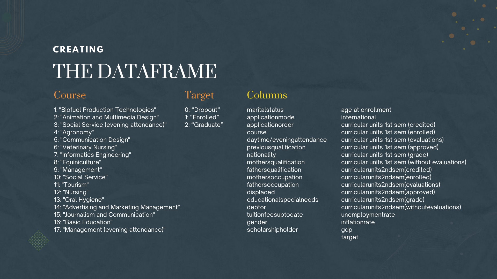
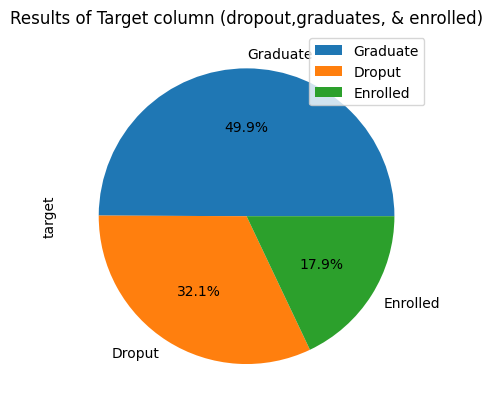
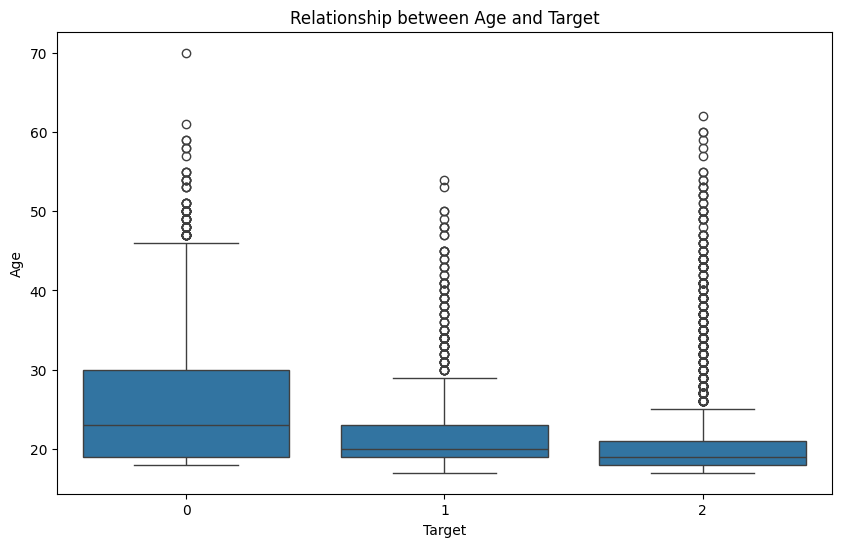
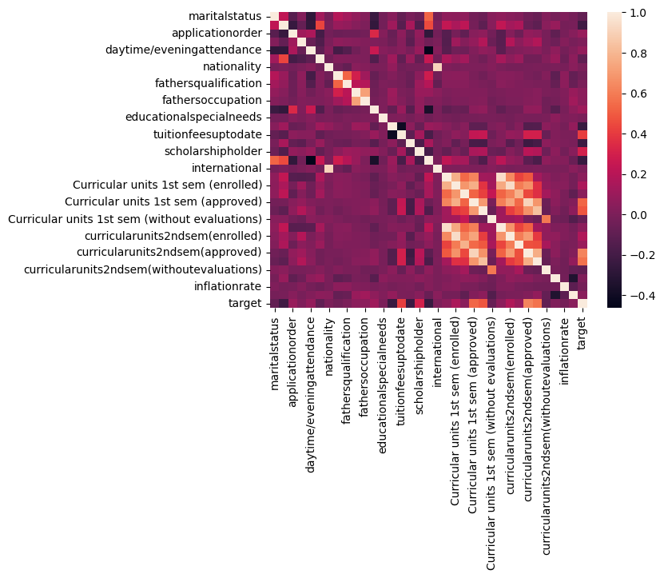
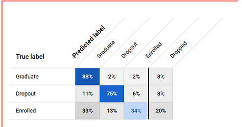

#Try out the Model
- [[Model Website](https://www.mdpi.com/2306-5729/7/11/146](https://advanced-obese-refrigerator.anvil.app/?fbclid=IwY2xjawOQ0tBleHRuA2FlbQIxMABicmlkETFIWVJacFlwZGt5cGd2elNUc3J0YwZhcHBfaWQQMjIyMDM5MTc4ODIwMDg5MgABHsUW0FDrK0qi9xh3FMG-UNXwEj-lwesLX_Dak5PaxnuG4M613XSGJbR2vw3a_aem_ySZokTHIOhAW-xYNH6KNnw)

# Predicting Student Dropout and Academic Success 🌐
Linear Regression Model to predict student dropout rate.

Outline:

[Data Visualization and Findings](#data-processing)

[Model Training and Evaluation](#model-training)

Resources Used:
- [MDPI Article](https://www.mdpi.com/2306-5729/7/11/146)

From this project our team created a machine learning system to predict from input of different demographic, socioeconomic, and macroeconomic information given by the participant on their probability on finishing their educational scholarship in a school.

# - What is the business problem? 
Qualification for scholarships in universities has to undergo criteria for the applicants that are committed to finishing their education and be considered an ideal investment to provide financial aid to education. The problem looks to understand factors that can cause students to drop out of a university and impact their academic outcomes.  The study in particular understands predictive factors that link to a student's dropout or completion by understanding what factors (course, mother/father occupation, displaced, age, gender, etc) interact with each other. With this research, it can safely predict the student dropout rate to improve the rate of student retention.

# - What is the business goal? 
This is significant to many universities, especially school administrators for scholarships, as they provide countless scholarship programs that depend on financial eligibility and academic performance. As scholarship programs are not given to every student who applies, we need to learn and predict students' backgrounds to effectively consider when looking out for higher-education scholarships. Scholarships are also considered to be an investment in a person's educational attainment, and if it can be predicted that a student could drop out from the program, discernment on their scholarship package can be adjusted.

# - Business Metric 
The continuous data that will be collated to estimate the student's overall performance will be the credited curricular units and enrolled curricular units. Gathering the metric will look through their first-semester academic performance to generally get an insight into their grades to predict for the future. This will be done with a large dataset of students and compare all categorical labels toward performance.

# Data processing

Dataset Column Descriptions

    Marital Status: The marital status of the student (e.g., single, married, divorced).

    Application Mode: Refers to the mode or type of application the student submitted to enroll in the course.

    Application Order: Indicates the order in which the student applied for the course. For example, whether it was the student’s first, second, or third choice.

    Course: The course or degree program the student is enrolled in (e.g., Computer Science, Engineering, etc.).

    Daytime/Evening Attendance: Specifies whether the student attends the course during the day or in the evening, representing their attendance schedule.

    Previous Qualification: The type of academic qualification the student had before enrolling in the course (e.g., high school diploma, vocational training).

    Previous Qualification (Grade): The final grade or score associated with the student's previous qualification.

    Nationality: The nationality of the student.

    Mother's Qualification: The highest academic qualification attained by the student's mother.

    Father's Qualification: The highest academic qualification attained by the student's father.

# Assumptions of the DataSet:
- The assumptions that we made for the data were that the 4300+ records of students' backgrounds and initial/later grades can represent a broader idea of student retention.
- Although the dataset only contains one semester's worth of data on grades/features/categories the scope of our study will focus on the retention of early dropout rates (to take on early interventions to improve retention rate)

# Findings from the Data Set

Scholar Stutus: From the data set it shows the percentage of scholars status in college whether they graduated, are still enrolled and droped out

Relationship between Age and Scholar Status: Using a histogram, our findings found that the dataset students mostly enroll in college at the ages of 18-22. Alongside a histogram that looks into the relationship between target (graduate, dropout, and enrolled) and age the results show that average dropout rates come from students who enroll to college in their early 20’s.

Using the Pearson correlation coefficient, shows that there are some pairs of features having high correlation coefficients, which increases multi-collinearity in the dataset.
- shows between the collinearity with different demographic , socioeconomic, macroeconomic, features of the student data set.

Insight

strongest in features in the same groups, such as “Nationality” and “International” or “Mother’s occupation” and “Father’s occupation”, but also between the groups related with the performance at the end of the first semester and the second semester, such as “Curricular units 1st sem (approved)” and “Curricular units 2nd sem (approved)”.

- Exploratory data analysis through pairwise correlation showed that there is little or weak correlation among the different features–aside from the “international” and “nationality” features as they pertain to similar values (if the student is an international student and what their nationality is, respectively), as well as the features about curricular units.
- On the other hand, the “curricular units,” “tuition fees up to date,” “scholarship holder,” age at enrollment,” “debtor,” and “gender” features have the highest correlation to the target variable.:
    - Of the variables mentioned, the number of curricular units approved and graded in the first and second semester have a significant correlation to the prediction of the target variable.:
        - The higher the number of any of the 4 variables, the more likely the student would graduate.
        - Most students who have 0-5 approved and/or units were tagged as dropouts
        - Majority of students who have more than 10 graded units were tagged as graduates by the dataset.
    - The other major variables that directly correlate to the target variable are whether or not a student has their tuition fees up to date, and if the student is currently a scholar.
        - A scholar with up-to-date tuition fees is more likely to graduate than a non-scholar with a history of late tuition fee payments.
    - Variables “age at enrolment”, “gender”, “debtor”, and “application mode” have a major inverse correlation to the target variable.
        - A surface-level analysis indicates that an 18 year old female non-debtor who is an international student is more likely to be predicted as a graduate than a middle aged male debtor who changed/shifted into the course.
    -For individual analysis on categorical values,  the target feature showcases an 82% on the results of the student dataset on retention to their university. Although most have graduated from their higher education (49.1%), there is still a higher margin of students that have dropped out (32.1%). 
    -Using a histogram, our findings found that the dataset students mostly enroll in college at the ages of 18-22. Alongside a histogram that looks into the relationship between target (graduate, dropout, and enrolled) and age the results show that average dropout rates come from students who enroll to college in their early 20’s.
    -Separating the Scholars and Non-Scholars when examining their relationship to the Target, the non-scholarship holders seemed to have an inconclusive correlation to the target, meanwhile, scholarship holders have a more pronounced correlation to the target with the majority of scholars graduating. Our examination found that scholars have a more distinct correlation to graduating compared to nonscholars.

# Conclusion of dataset
This descriptor presents a dataset created from the Polytechnic Institute of Portalegre (acquired from several disjoint databases) related to students enrolled in different undergraduate degrees, such as agronomy, design, education, nursing, journalism, management, social service, and technologies. It contains 4424 records with 35 attributes that include information known at the time of student enrollment, demographics, socioeconomics, macroeconomics data, and students’ academic performance at the end of the first and second semesters.
The dataset is useful for researchers who want to conduct comparative studies on student academic performance and also for training in the machine learning area.

# Model Training

📺 - [Model Demonstration]([https://www.mdpi.com/2306-5729/7/11/146](https://www.youtube.com/watch?v=E9MJ1UI__T8))

Method

# ML  used?:  
Given the supervised & structured nature of the dataset—that is, containing more than two class labels (i.e., “Graduate,” “Dropout,” and “Enrolled”)—multi-class classification should be used by the machine learning project to predict. Under this type of machine, we will be doing regression to predict the continuous value for our labels.

- for our algorithm we used the random forest classifier as it can solve for regression or classification problems
- percentage of data for training 80%, 10% for validation and 10% for testing

# evaluation Metric
After checking the evaluation there might be a need to reconsider enrolled as a possible target as its prediction rate is lower than other targets.

for our chosen metric we covered the precision-recall (PR) AUC curve. 

